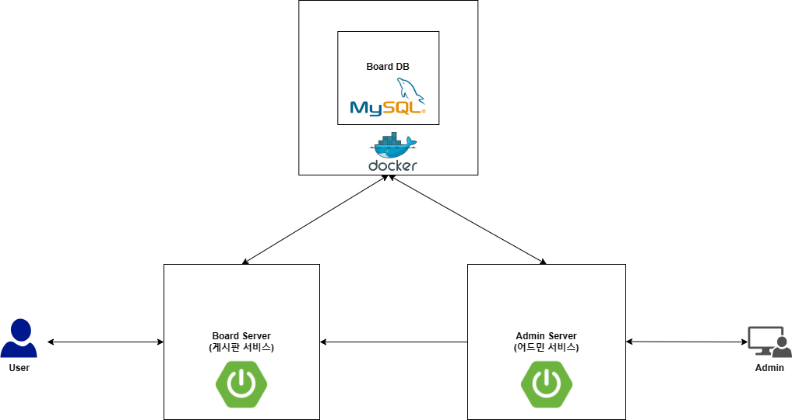

## 어드민 게시판 서비스

## 소개

[게시판서비스](https://github.com/daecheolsong/board-project)를 관리하는 어드민 게시판 서비스.

게시판서비스의 게시글, 회원, 댓글 관리를 어드민 회원이 관리한다.

## Architecture

## 기능

### 관리

- 게시물
    - 삭제
- 댓글
    - 삭제
- 회원
    - 삭제

### 어드민

- 회원
    - 생성 : 로그인, Kakao OAuth2로만 가능, 회원가입 미구현
    - 삭제

### 부가기능

- 채팅 : 에코봇
- 다크모드
- 방문횟수 집계

## 기술

- Framework : Spring, Spring Boot
- 빌드 및 의존성 관리 : gradle
- DB, DB 엑세스, 쿼리 : mysql, H2 (Test), Spring Data JPA, QueryDSL
- RESTful API  : Spring Data Rest Repositories, Repositories HAL Explorer

- 웹 : Spring Web
- 디자인 : Bootstrap 5.2, AdminLTE
- 인증 : Spring Security, Spring OAuth2 Client
- 생산성 : lombok, Spring devtools, Spring boot Actuator, Spring Configuration Processor
- 프로젝트, 형상관리 : github, gitKraken
- 템플릿 : Thyemleaf
- 메시지 : Spring WebSocket
